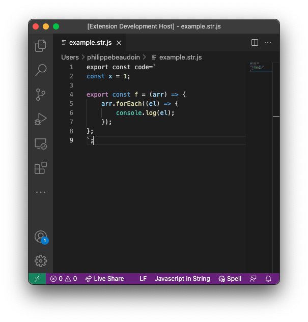

# js-in-string support for javascript in string literals

This very basic VSCode extension supports syntax highlighting file with the `.str.js` extension which contains javascript code in backtick-quoted string literals. For example:

```javascript
export const code=`
const x = 1;

export const f = (arr) => {
    arr.forEach((el) => {
        console.log(el);
    });
};
`;
```

(Naturally the code between the backticks shouldn't contain backtick-quoted strings.)

In the above code, the entire code between the backticks would be correctly syntax-highlighted by this extension.

Files of type `.str.js` are useful for embedding javascript code inside other javascript files, however without this extension, all the important code is highlighted as a string.

## Features

Simple syntax highlighting.



## Release Notes

### 1.0.0

Initial release of this extension.
